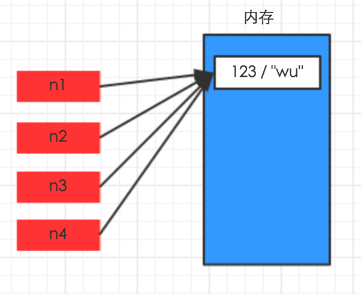
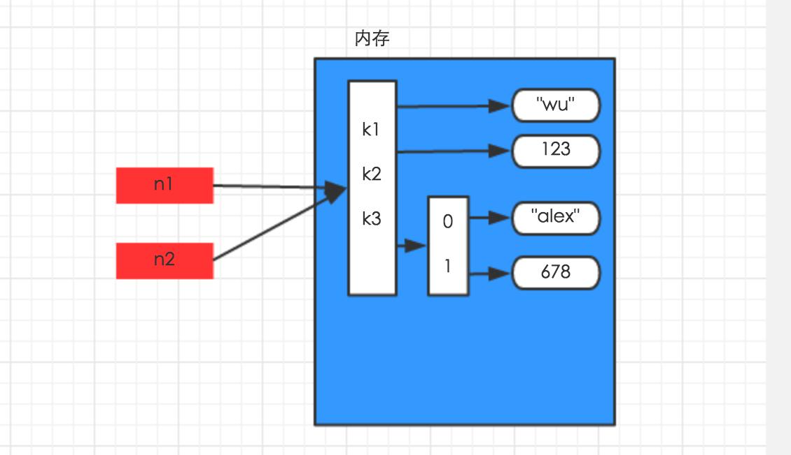
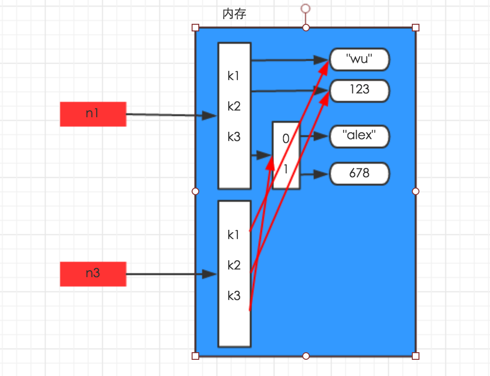
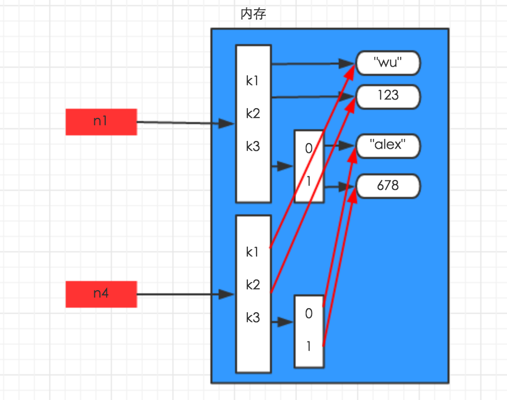

# learning python notes
**Table of Contents**

    
   * [python基础知识](#python基础知识)
      * [基本数据类型](#基本数据类型)
      * [copy](#copy)
      * [%与format格式化字符串](#%与format格式化字符串)
      


# python基础知识


## 基本数据类型


## copy
### 1、对于 数字 和 字符串 而言，
赋值、浅拷贝和深拷贝无意义，因为其永远指向同一个内存地址。
```python
import copy
# ######### 数字、字符串 #########
n1 = 123
# n1 = "i am alex age 10"
print(id(n1))

# ## 赋值 ##
n2 = n1
print(id(n2))

# ## 浅拷贝 ##
n2 = copy.copy(n1)
print(id(n2))# 

# ## 深拷贝 ##
n3 = copy.deepcopy(n1)
print(id(n3))

```



  
### 2、对于字典、元祖、列表 而言，
进行赋值、浅拷贝和深拷贝时，其内存地址的变化是不同的。
#### 1)、赋值
赋值，只是创建一个变量，该变量指向原来内存地址，如：
```python
n1 = {"k1": "wu", "k2": 123, "k3": ["alex", 456]}
  
n2 = n1
```



#### 2)、浅拷贝
浅拷贝，在内存中只额外创建第一层数据
```python
import copy
  
n1 = {"k1": "wu", "k2": 123, "k3": ["alex", 456]}
  
n3 = copy.copy(n1)
```


#### 3)、深拷贝
深拷贝，在内存中将所有的数据重新创建一份（排除最后一层，即：python内部对字符串和数字的优化）
```python
import copy
  
n1 = {"k1": "wu", "k2": 123, "k3": ["alex", 456]}
  
n4 = copy.deepcopy(n1)
```


### 3、copy例子

```python
import copy
a = [1, 2, 3, 4, ['a', 'b']] 
b = a     # 引用，除非直接给a重新赋值，否则a变则b变，b变则a变
c = copy.copy(a)   # 浅复制，只会拷贝父对象， 不会拷贝父对象中的子对象，所以若a的子对象变则c 变,但是父对象变c不会变
d = copy.deepcopy(a) #深拷贝，完全拷贝，完全独立于原对象，a变也不变
a.append(5) # 改变父对象
a[4].append('c')  #改变父对象中的 ['a', 'b']子对象

# a=[1, 2, 3, 4, ['a', 'b','c'],5] 
# b=[1, 2, 3, 4, ['a', 'b','c'],5] 
# c=[1, 2, 3, 4, ['a', 'b','c']] 
# d=[1, 2, 3, 4, ['a', 'b']] 
```


## %与format格式化字符串
1、百分号方式
```
%[(name)][flags][width].[precision]typecode
```

(name)      可选，用于选择指定的key
flags          可选，可供选择的值有
```
+       右对齐；正数前加正好，负数前加负号；
-        左对齐；正数前无符号，负数前加负号；
空格    右对齐；正数前加空格，负数前加负号；
0        右对齐；正数前无符号，负数前加负号；用0填充空白处
```
width         可选，占有宽度
.precision   可选，小数点后保留的位数
typecode    必选
```angular2html
s，获取传入对象的__str__方法的返回值，并将其格式化到指定位置
r，获取传入对象的__repr__方法的返回值，并将其格式化到指定位置
c，整数：将数字转换成其unicode对应的值，10进制范围为 0 <= i <= 1114111（py27则只支持0-255）；字符：将字符添加到指定位置
o，将整数转换成 八  进制表示，并将其格式化到指定位置
x，将整数转换成十六进制表示，并将其格式化到指定位置
d，将整数、浮点数转换成 十 进制表示，并将其格式化到指定位置
e，将整数、浮点数转换成科学计数法，并将其格式化到指定位置（小写e）
E，将整数、浮点数转换成科学计数法，并将其格式化到指定位置（大写E）
f， 将整数、浮点数转换成浮点数表示，并将其格式化到指定位置（默认保留小数点后6位）
F，同上
g，自动调整将整数、浮点数转换成 浮点型或科学计数法表示（超过6位数用科学计数法），并将其格式化到指定位置（如果是科学计数则是e；）
G，自动调整将整数、浮点数转换成 浮点型或科学计数法表示（超过6位数用科学计数法），并将其格式化到指定位置（如果是科学计数则是E；）
%，当字符串中存在格式化标志时，需要用 %%表示一个百分号
```
注：Python中百分号格式化是不存在自动将整数转换成二进制表示的方式

常用格式化：
```python
tpl = "i am %s" % "alex"
# i am alex

tpl = "i am %s age %d" % ("alex", 18)
tpl = "i am %s age %s" % ("alex", 18)
tpl = "i am %(name)s age %(age)d" % {"name": "alex", "age": 18}
# i am alex age 18

tpl = "percent %.2f" % 99.97623
# percent 99.98

tpl = "i am %(pp).2f" % {"pp": 123.425556, }
tpl = "i am %(pp).2f %%" % {"pp": 123.425556, }
# i am 123.43
```
## 2、Format方式
```
[[fill]align][sign][#][0][width][,][.precision][type]
```


fill           【可选】空白处填充的字符
align        【可选】对齐方式（需配合width使用）
```
<，内容左对齐
>，内容右对齐(默认)
＝，内容右对齐，将符号放置在填充字符的左侧，且只对数字类型有效。 即使：符号+填充物+数字
^，内容居中
```
sign         【可选】有无符号数字
```
+，正号加正，负号加负；
 -，正号不变，负号加负；
空格 ，正号空格，负号加负；
```
#            【可选】对于二进制、八进制、十六进制，如果加上#，会显示 0b/0o/0x，否则不显示
，            【可选】为数字添加分隔符，如：1,000,000
width       【可选】格式化位所占宽度
.precision 【可选】小数位保留精度
type         【可选】格式化类型
```
传入” 字符串类型 “的参数
    s，格式化字符串类型数据
    空白，未指定类型，则默认是None，同s
传入“ 整数类型 ”的参数
    b，将10进制整数自动转换成2进制表示然后格式化
    c，将10进制整数自动转换为其对应的unicode字符
    d，十进制整数
    o，将10进制整数自动转换成8进制表示然后格式化；
    x，将10进制整数自动转换成16进制表示然后格式化（小写x）
    X，将10进制整数自动转换成16进制表示然后格式化（大写X）
传入“ 浮点型或小数类型 ”的参数
    e， 转换为科学计数法（小写e）表示，然后格式化；
    E， 转换为科学计数法（大写E）表示，然后格式化;
    f ， 转换为浮点型（默认小数点后保留6位）表示，然后格式化；
    F， 转换为浮点型（默认小数点后保留6位）表示，然后格式化；
    g， 自动在e和f中切换
    G， 自动在E和F中切换
    %，显示百分比（默认显示小数点后6位）
```

 常用格式化：
tpl = "i am {}, age {}, {}".format("seven", 18, 'alex')
  
tpl = "i am {}, age {}, {}".format(*["seven", 18, 'alex'])
  
tpl = "i am {0}, age {1}, really {0}".format("seven", 18)
  
tpl = "i am {0}, age {1}, really {0}".format(*["seven", 18])
  
tpl = "i am {name}, age {age}, really {name}".format(name="seven", age=18)
  
tpl = "i am {name}, age {age}, really {name}".format(**{"name": "seven", "age": 18})
  
tpl = "i am {0[0]}, age {0[1]}, really {0[2]}".format([1, 2, 3], [11, 22, 33])
  
tpl = "i am {:s}, age {:d}, money {:f}".format("seven", 18, 88888.1)
  
tpl = "i am {:s}, age {:d}".format(*["seven", 18])
  
tpl = "i am {name:s}, age {age:d}".format(name="seven", age=18)
  
tpl = "i am {name:s}, age {age:d}".format(**{"name": "seven", "age": 18})
 
tpl = "numbers: {:b},{:o},{:d},{:x},{:X}, {:%}".format(15, 15, 15, 15, 15, 15.87623, 2)
 
tpl = "numbers: {:b},{:o},{:d},{:x},{:X}, {:%}".format(15, 15, 15, 15, 15, 15.87623, 2)
 
tpl = "numbers: {0:b},{0:o},{0:d},{0:x},{0:X}, {0:%}".format(15)
 
tpl = "numbers: {num:b},{num:o},{num:d},{num:x},{num:X}, {num:%}".format(num=15)


